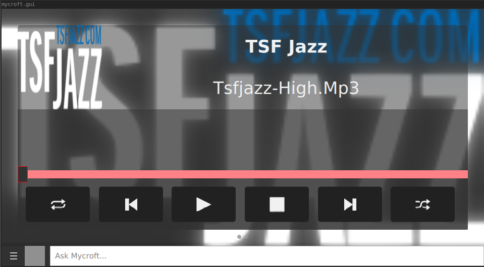

#  Pyradios

OCP skill for [Pyradios](https://github.com/andreztz/pyradios), a client for the [Radio Browser API](https://api.radio-browser.info/)

## Examples

* "play tsf jazz radio"
* "play tsf jazz on pyradios"

## Credits

-[Pyradios](https://github.com/andreztz/pyradios)

## Category

Entertainment

## Tags

\#audio
\#music
\#OCP
\#entertainment
