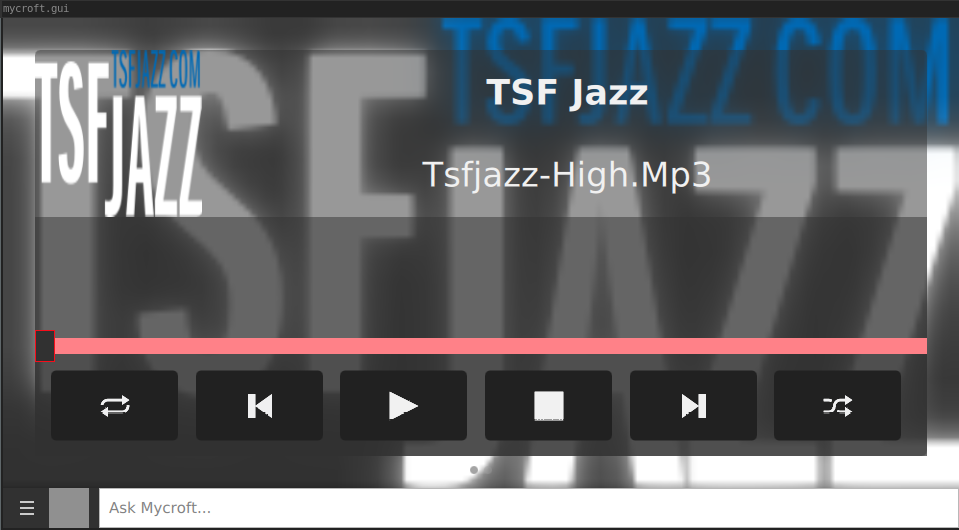

> # ⚠️ DEPRECATED
>
> This OCP **search skill** is deprecated and unmaintained. OCP search skills
> (`OVOSCommonPlaybackSkill` + `@ocp_search`) are replaced by **MediaProvider
> plugins** in the [`ovos-media`](https://github.com/OpenVoiceOS/ovos-media) stack:
>
> - **How MediaProviders work / how to migrate:** https://github.com/OpenVoiceOS/ovos-media/blob/dev/docs/media-providers.md
> - **Base-class deprecation:** [ovos-workshop#423](https://github.com/OpenVoiceOS/ovos-workshop/pull/423)
> - **Replacement:** [`ovos-media-provider-pyradios`](https://github.com/OpenVoiceOS/ovos-media-provider-pyradios)
>
> This repository will be archived.

#  Pyradios

OCP skill for [Pyradios](https://github.com/andreztz/pyradios), a client for the [Radio Browser API](https://api.radio-browser.info/)

## Examples

* "play tsf jazz radio"
* "play tsf jazz on pyradios"

## Credits

* [Pyradios](https://github.com/andreztz/pyradios)

## Category

Entertainment

## Tags

\#audio
\#music
\#OCP
\#entertainment
